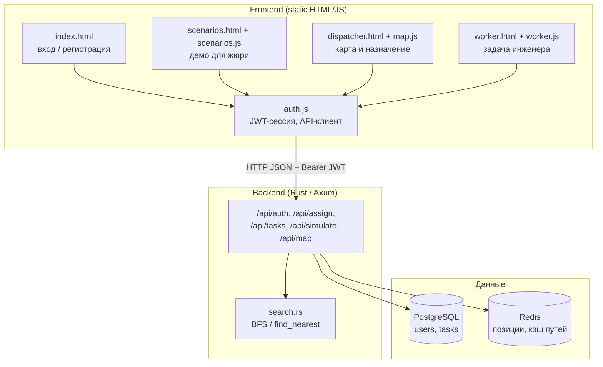
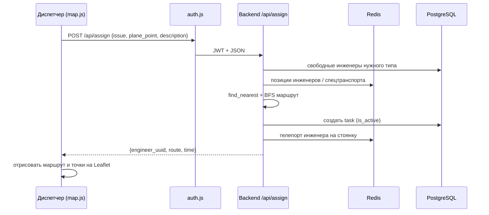

# Техническое описание — SkyMunky / Aeroflot ОТО

Документ для сдачи и демонстрации жюри: принцип работы, структура кода, технические характеристики.

---

## 1. Описание принципа работы

Система моделирует оперативное техническое обслуживание (ОТО) воздушных судов на перроне.

### Роли

| Роль | Что делает |
|------|------------|
| **Диспетчер** | Создаёт заявку: стоянка ВС + тип неисправности → система назначает инженера и строит маршрут |
| **Инженер** | Получает назначение, видит маршрут, принимает задачу в работу |

### Логика назначения

1. Диспетчер выбирает **стоянку** и **тип неисправности**.
2. Backend по типу неисправности определяет **нужную специализацию** инженера и (если нужно) **тип спецтранспорта**.
3. Среди свободных инженеров нужного типа выбирается ближайший (поиск пути по клеточной карте перрона).
4. Если для неисправности нужен спецтранспорт, маршрут идёт **инженер → техника → стоянка ВС**.
5. Занятый инженер на активной задаче того же типа **не назначается повторно** (внештатная ситуация «несколько вызовов подряд»).
6. Если подходящего специалиста нет — API возвращает ошибку, frontend показывает:  
   **«На данную исправность отсутствует подходящий специалист»**.

### Карта и контрольные точки

* Карта перрона — тайловая (`real_map.tmj` + спрайты дорог/ВС).
* Контрольные точки: **стоянки ВС**, **инженеры**, **спецтранспорт**, **маршрут**.
* Позиции инженеров и техники хранятся в **Redis**; пользователи и задачи — в **PostgreSQL**.

### Демо-режим для жюри

На экране входа есть блок **«Демо-сценарии»**: 5 расстановок на одной карте, 30 заранее заданных аккаунтов, переключение диспетчер ↔ инженеры без ручной регистрации.  
Обычный вход (кнопки «Диспетчер» / «Инженер») демо-UI не показывает.

---

## 2. Блок-схема кода и ключевые модули

### Общая архитектура

### Поток назначения заявки

### Карта файлов frontend (демонстрация структуры кода)

| Файл | Назначение |
|------|------------|
| `frontend/auth.js` | Логин/регистрация, JWT, общий `apiRequest` |
| `frontend/map.js` | Leaflet-карта диспетчера, assign, маркеры сотрудников/транспорта |
| `frontend/worker.js` | Экран инженера, `GET /api/tasks/current`, `POST .../accept` |
| `frontend/scenarios.js` | 5 сценариев, сид 30 аккаунтов, расстановки |
| `frontend/scenarios.html` | UI хаба сценариев для жюри |
| `frontend/real_map.tmj` | Тайловая карта перрона |
| `frontend/assets/*.png` | Тайлсет дорог и самолётов |

### Карта backend (ключевые точки)

| Модуль | Назначение |
|--------|------------|
| `backend/src/router/mod.rs` | `assign_engineer`, задачи, карта |
| `backend/src/router/simulate.rs` | Позиции инженеров и спецтранспорта |
| `backend/src/search.rs` | BFS и поиск ближайшей цели |
| `backend/src/types/enums.rs` | Неисправности → специализация / спецтранспорт |
| `tools/scheduler/` | Автозакрытие задач по сроку |

### Фрагменты логики (для скринов / цитирования)

**Неисправность → специализация и техника** (`backend/src/types/enums.rs`):

* `responsible_engineer()` — кто чинит;
* `required_vehicle()` — нужен ли fuel_truck / lift / КПА и т.д.

**Назначение** (`backend/src/router/mod.rs`, handler `assign_engineer`):

* фильтр свободных инженеров;
* опциональный заезд к спецтранспорту;
* запись задачи и обновление позиции.

**Frontend assign** (`frontend/map.js`): вызов `/api/assign`, отрисовка polyline маршрута, подсветка заезда к технике, понятные тексты ошибок.

---

## 2.1. Ввод / вывод по демо-сценариям

Замеры `POST /api/assign` на локальном стенде. На **входе** у каждой демки одинаковый состав команды и флота, отличаются только координаты расстановки и порядок стоянок.

**Состав входа (для всех 5 демок):**
- инженеры: 2× инспектор целостности, 1× авиатехник, 1× авионика, 1× техник по двигателю;
- спецтранспорт: топливозаправщик, маслораздаточная, подъёмник, бороскоп-тележка, КПА авионики (5 единиц);
- 6 вызовов подряд (5 успешных + 1 отказ без специалиста).

**Смысл выхода при успехе:** маршрут от ближайшего свободного инженера нужного типа до стоянки ВС; если для неисправности нужен спецтранспорт — в маршруте есть **промежуточная точка заезда** к этой технике; плюс ETA и uuid инженера. При отказе — текст «нет подходящего специалиста», маршрута нет.

| Демка | Вход (расстановка / порядок) | Выход |
|-------|------------------------------|-------|
| **1. Северный перрон** | Базовая расстановка у стоянок A; вызовы: A-01 топливо → A-02 топливо → B-01 сколы → B-02 РЛС → C-01 тяга → Техцентр ремни | **A-01:** маршрут ближайшего инспектора, с заездом к топливозаправщику; ~18 клеток, ETA ~6 мин; ответ бэка **21 мс**. **A-02:** маршрут второго инспектора (первый занят), с заездом к топливозаправщику; ~10 клеток, ETA ~4 мин; **10 мс**. **B-01:** маршрут авиатехника с заездом к подъёмнику; ~35 клеток, ETA ~12 мин; **11 мс**. **B-02:** маршрут авионики с заездом к КПА; ~58 клеток, ETA ~20 мин; **13 мс**. **C-01:** маршрут техника по двигателю с заездом к бороскопу; ~28 клеток, ETA ~10 мин; **11 мс**. **Техцентр:** маршрута нет — «на данную исправность отсутствует подходящий специалист»; **3 мс** |
| **2. Восточный сектор** | Расстановка смещена к стоянкам B; вызовы: B-01 топливо → B-02 топливо → A-01 сколы → C-01 РЛС → A-02 тяга → Техцентр ремни | **B-01:** маршрут ближайшего инспектора с заездом к топливозаправщику; ~65 клеток, ETA ~22 мин; **19 мс**. **B-02:** маршрут второго инспектора с заездом к топливозаправщику; ~58 клеток, ETA ~20 мин; **17 мс**. **A-01:** маршрут авиатехника с заездом к подъёмнику; ~98 клеток, ETA ~33 мин; **18 мс**. **C-01:** маршрут авионики с заездом к КПА; ~42 клетки, ETA ~14 мин; **15 мс**. **A-02:** маршрут техника по двигателю с заездом к бороскопу; ~91 клетка, ETA ~31 мин; **16 мс**. **Техцентр:** нет специалиста, маршрута нет; **4 мс** |
| **3. Южная зона** | Южная расстановка; вызовы: C-01 топливо → A-01 топливо → B-02 сколы → A-02 РЛС → B-01 тяга → Техцентр ремни | **C-01:** маршрут ближайшего инспектора с заездом к топливозаправщику; ~92 клетки, ETA ~31 мин; **23 мс**. **A-01:** маршрут второго инспектора с заездом к топливозаправщику; ~97 клеток, ETA ~33 мин; **17 мс**. **B-02:** маршрут авиатехника с заездом к подъёмнику; ~92 клетки, ETA ~31 мин; **14 мс**. **A-02:** маршрут авионики с заездом к КПА; ~50 клеток, ETA ~17 мин; **14 мс**. **B-01:** маршрут техника по двигателю с заездом к бороскопу; ~86 клеток, ETA ~29 мин; **15 мс**. **Техцентр:** нет специалиста, маршрута нет; **4 мс** |
| **4. Западный рулёж** | Западная расстановка; вызовы: A-02 топливо → C-01 топливо → B-01 сколы → B-02 РЛС → A-01 тяга → Техцентр ремни | **A-02:** маршрут ближайшего инспектора с заездом к топливозаправщику; ~90 клеток, ETA ~30 мин; **23 мс**. **C-01:** маршрут второго инспектора с заездом к топливозаправщику; ~93 клетки, ETA ~31 мин; **16 мс**. **B-01:** маршрут авиатехника с заездом к подъёмнику; ~99 клеток, ETA ~33 мин; **14 мс**. **B-02:** маршрут авионики с заездом к КПА; ~68 клеток, ETA ~23 мин; **14 мс**. **A-01:** маршрут техника по двигателю с заездом к бороскопу; ~97 клеток, ETA ~33 мин; **16 мс**. **Техцентр:** нет специалиста, маршрута нет; **3 мс** |
| **5. Смешанный перрон** | Смешанная расстановка; вызовы: B-02 топливо → A-01 топливо → A-02 сколы → C-01 РЛС → B-01 тяга → Техцентр ремни | **B-02:** маршрут ближайшего инспектора с заездом к топливозаправщику; ~58 клеток, ETA ~20 мин; **23 мс**. **A-01:** маршрут второго инспектора с заездом к топливозаправщику; ~97 клеток, ETA ~33 мин; **15 мс**. **A-02:** маршрут авиатехника с заездом к подъёмнику; ~92 клетки, ETA ~31 мин; **18 мс**. **C-01:** маршрут авионики с заездом к КПА; ~42 клетки, ETA ~14 мин; **14 мс**. **B-01:** маршрут техника по двигателю с заездом к бороскопу; ~86 клеток, ETA ~29 мин; **15 мс**. **Техцентр:** нет специалиста, маршрута нет; **4 мс** |

Формат JSON при успехе: `{ engineer_uuid, route[], time, time_limit_exceeded }`, где `route` — последовательность клеток (старт инженера → … → [точка спецтранспорта, если нужна] → … → стоянка ВС).

---

## 3. Технические характеристики

| Параметр | Значение |
|----------|----------|
| Backend | Rust, Axum, Diesel, JWT |
| Frontend | Vanilla JS, Leaflet 1.9, HTML/CSS |
| БД | PostgreSQL 15 |
| Кэш / позиции | Redis |
| Планировщик задач | Python-сервис `tools/scheduler` |
| Контейнеризация | Docker Compose |
| API | REST JSON, порт **3001** |
| Frontend (локально) | статика, порт **8001** (пример) |
| Карта | ортогональный тайловый перрон 64×64, клетка 16px |
| Аутентификация | access + refresh JWT |
| Роли | `Dispatcher`, `Engineer` |
| Специализации инженеров | inspector / fueling / crew remarks / engine / avionics / aviation tech |
| Спецтранспорт | fuel_truck, oil_cart, maintenance_lift, borescope_cart, avionics_test_set |
| Поиск пути | BFS по проходимым клеткам карты |
| Демо | 5 сценариев × (1 диспетчер + 5 инженеров) = 30 аккаунтов |

### Зависимости окружения

* Docker Desktop / Docker Engine + Compose  
* Браузер с поддержкой ES6  
* (опционально) Python 3 для `python -m http.server`

### Основные API-ручки

| Метод | Путь | Назначение |
|-------|------|------------|
| POST | `/api/auth/register` | Регистрация |
| POST | `/api/auth/login` | Вход |
| POST | `/api/assign` | Назначение инженера + маршрут |
| GET | `/api/tasks/current` | Текущая задача инженера |
| POST | `/api/tasks/current/accept` | Принятие задачи |
| GET | `/api/simulate/get_engineers_positions` | Позиции инженеров |
| POST | `/api/simulate/update_engineer_position` | Обновление позиции |
| GET/POST | `/api/simulate/get_transport_positions` / `update_transport_position` | Спецтранспорт |
| GET | `/api/map` | Матрица карты |

---

## 4. Связанные разделы README

Инструкции по запуску Docker, раздаче frontend и **сбросу пользователей/задач/Redis** находятся в корневом [`README.md`](../README.md).
